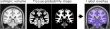

# Label-map overlap for isotropic medical images



This Python example overlays a medical-image slice with a transparent label map derived from tissue probability maps in NIfTI files.
The example assumes isotropic voxel spacing and extracts slices from the ICBM 152 2009a Nonlinear Symmetric template.


## Scope of the example

This repository demonstrates how to:

- load 3D medical images in NIfTI format
- extract and orient corresponding 2D subarrays
- convert tissue probabilities into a discrete label map
- explicitly define an RGBA color overlay
- save a PNG image overlaid with a transparent label map

The goal is to export square images as an intermediate data representation for more complex example figures.


## Quick start

Install dependencies:
```sh
pip install matplotlib nibabel numpy
```

Run the example:
```sh
python recipe.py
```

This generates a square image overlaid with labels (`overlay.png`).
